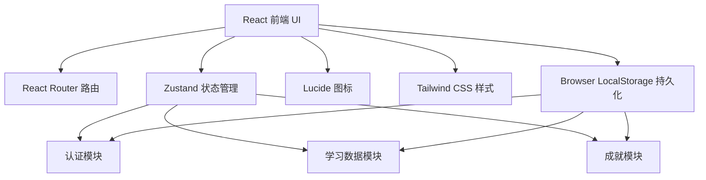
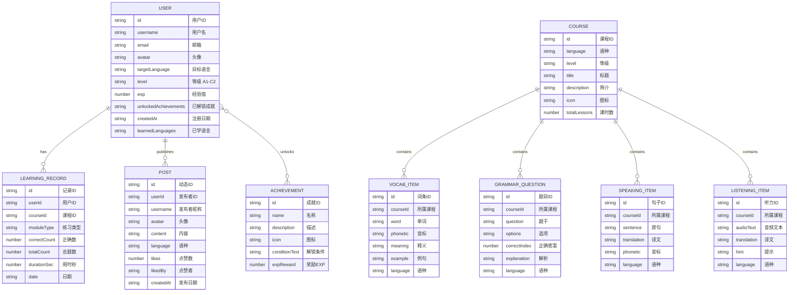
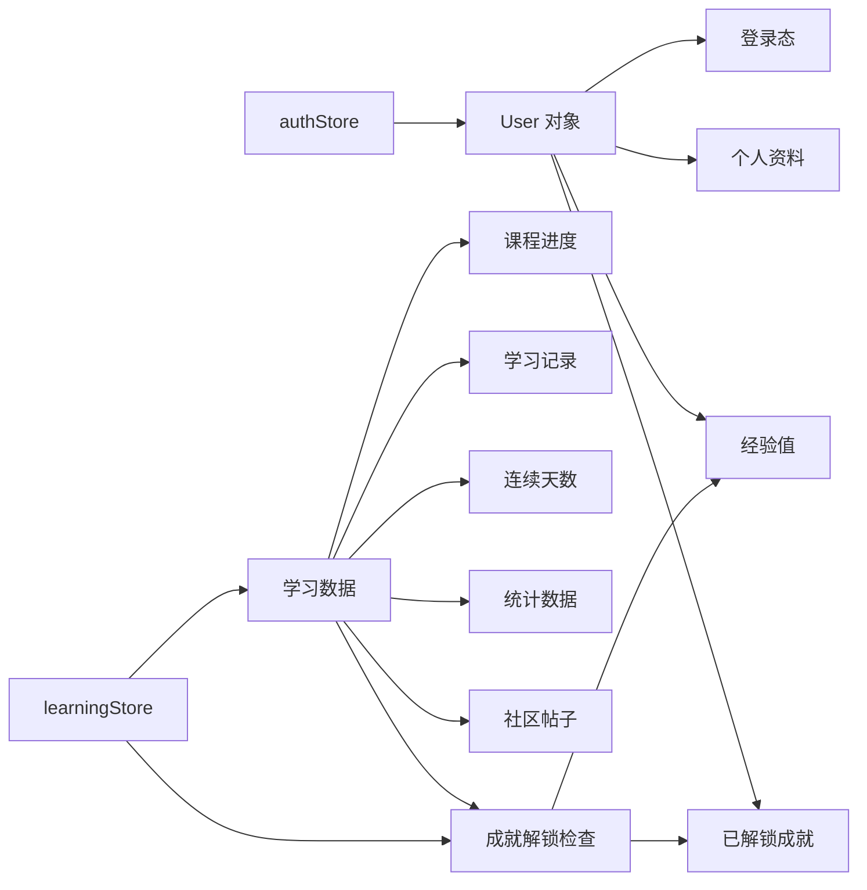

## 1. 架构设计



## 2. 技术描述

- **前端框架**：React 18 + TypeScript + Vite
- **后端**：无独立后端，使用浏览器 LocalStorage 模拟数据持久化（Demo 阶段）
- **数据库**：Browser LocalStorage + 内存状态管理（Zustand）
- **样式**：Tailwind CSS 3.x
- **状态管理**：Zustand
- **路由**：React Router DOM v6
- **图标**：lucide-react
- **语音合成**：Web Speech API（浏览器原生 speechSynthesis）

## 3. 路由定义

| 路由 | 页面 | 说明 |
|------|------|------|
| `/` | 首页 Home | 品牌展示、语言入口、学习概览 |
| `/login` | 登录 Login | 邮箱/密码登录 |
| `/register` | 注册 Register | 创建新账户 |
| `/courses` | 课程中心 Courses | 语言 Tab + 等级筛选 + 课程列表 |
| `/learn/vocab/:courseId` | 单词记忆 | 闪卡模式 |
| `/learn/grammar/:courseId` | 语法练习 | 选择题模式 |
| `/learn/speaking/:courseId` | 口语跟读 | TTS 朗读 + 用户跟读 |
| `/learn/listening/:courseId` | 听力训练 | 音频播放 + 文本输入 |
| `/learning` | 学习中心 Learning | 学习进度 + 成就 + 个性化推荐（三 Tab） |
| `/progress` | 学习进度 Progress | 统计图表 + 连续学习天数（重定向到 /learning） |
| `/recommend` | 个性化推荐 Recommend | 基于数据推荐（重定向到 /learning） |
| `/community` | 社区交流 Community | 动态发布 + 互动 |
| `/achievements` | 成就激励 Achievements | 徽章墙 + 等级（重定向到 /learning） |
| `/profile` | 个人中心 Profile | 资料 + 设置 |

## 4. 数据模型

### 4.1 数据模型图

平台核心数据实体及其关联关系如下（用户与课程为两大核心实体，通过学习记录、社区动态、成就徽章形成闭环）：



### 4.2 核心数据结构（TypeScript）

```typescript
// 用户
interface User {
  id: string;
  username: string;
  email: string;
  avatar: string;
  targetLanguage: 'en' | 'ja' | 'ko';
  level: 'A1' | 'A2' | 'B1' | 'B2' | 'C1' | 'C2';
  exp: number;
  unlockedAchievements: string[];
  createdAt: string;
}

// 课程
interface Course {
  id: string;
  language: 'en' | 'ja' | 'ko';
  level: 'A1' | 'A2' | 'B1' | 'B2' | 'C1' | 'C2';
  title: string;
  description: string;
  icon: string;
  totalLessons: number;
}

// 学习记录
interface LearningRecord {
  id: string;
  userId: string;
  courseId: string;
  moduleType: 'vocab' | 'grammar' | 'speaking' | 'listening';
  correctCount: number;
  totalCount: number;
  durationSec: number;
  date: string;
}

// 动态
interface Post {
  id: string;
  userId: string;
  username: string;
  avatar: string;
  content: string;
  language: string;
  likes: number;
  likedBy: string[];
  comments: Comment[];
  createdAt: string;
}

// 成就
interface Achievement {
  id: string;
  name: string;
  description: string;
  icon: string;
  condition: string;
  expReward: number;
}
```

## 5. 项目目录结构

```
linguanest/
├── src/
│   ├── components/          # 可复用组件
│   │   ├── Navbar.tsx         # 顶部导航栏
│   │   ├── Footer.tsx          # 页脚
│   │   ├── CourseCard.tsx     # 课程卡片
│   │   ├── AchievementBadge.tsx # 成就徽章组件
│   │   ├── AchievementToast.tsx # 成就解锁通知
│   │   └── PostCard.tsx       # 社区帖子卡片
│   ├── pages/               # 页面组件
│   │   ├── Home.tsx           # 首页
│   │   ├── Login.tsx          # 登录页
│   │   ├── Register.tsx       # 注册页
│   │   ├── Courses.tsx        # 课程中心
│   │   ├── VocabLearn.tsx     # 单词记忆
│   │   ├── GrammarLearn.tsx   # 语法练习
│   │   ├── SpeakingLearn.tsx  # 口语跟读
│   │   ├── ListeningLearn.tsx # 听力训练
│   │   ├── Learning.tsx       # 学习中心（进度+成就+推荐三Tab）
│   │   ├── Community.tsx      # 社区交流
│   │   └── Profile.tsx        # 个人中心
│   ├── store/               # Zustand 状态管理
│   │   ├── authStore.ts        # 认证状态（用户信息、登录登出）
│   │   └── learningStore.ts    # 学习数据（记录、统计、帖子、成就）
│   ├── data/                # 模拟数据
│   │   ├── index.ts           # 数据统一导出
│   │   ├── courses.ts         # 课程数据
│   │   ├── vocab.ts           # 单词数据
│   │   ├── grammar.ts         # 语法数据
│   │   ├── speaking.ts         # 口语数据
│   │   ├── listening.ts       # 听力数据
│   │   └── achievements.ts     # 成就数据
│   ├── utils/               # 工具函数
│   │   ├── storage.ts          # LocalStorage 封装
│   │   ├── speech.ts           # 语音合成（Web Speech API）
│   │   └── recommend.ts         # 推荐算法
│   ├── types/               # 类型定义
│   │   └── index.ts            # 全局 TypeScript 接口
│   ├── App.tsx                 # 路由配置入口
│   ├── main.tsx                # React DOM 挂载
│   └── index.css               # 全局样式 + Tailwind
├── docs/
│   ├── PRD.md                  # 产品需求文档
│   └── ARCHITECTURE.md          # 架构设计文档
├── index.html
├── package.json
├── tsconfig.json
├── vite.config.ts
├── tailwind.config.js
└── postcss.config.js
```

## 6. 状态管理架构



## 7. 推荐算法说明

个性化推荐基于以下维度：
1. **当前等级**：匹配 A1-C2 分级的课程内容
2. **最近练习类型**：补充用户薄弱的练习类型（单词/语法/口语/听力）
3. **正确率**：正确率 < 60% 的模块优先推荐基础课程
4. **已完成课程**：推荐未完成或下一等级课程
5. **目标语言**：仅推荐用户当前选择的语言

## 8. 成就解锁条件（示例）

| 成就ID | 名称 | 条件 |
|--------|------|------|
| first-lesson | 初心者 | 完成第一次学习 |
| streak-7 | 七日坚持 | 连续学习 7 天 |
| streak-30 | 月度学者 | 连续学习 30 天 |
| vocab-100 | 词汇达人 | 掌握 100 个单词 |
| grammar-50 | 语法专家 | 正确回答 50 道语法题 |
| perfect-score | 完美表现 | 任意练习全对 |
| polyglot | 多语者 | 学习过 2 种及以上语言 |
| community-post | 活跃分享者 | 发布第一条社区动态 |
