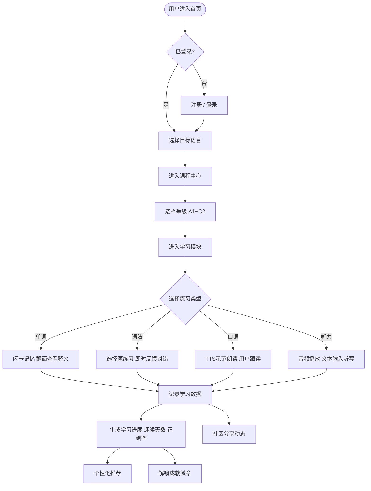

## 1. 产品概述

LinguaNest 是一款面向全球语言学习者的沉浸式在线教育平台，聚焦英语、日语、韩语等主流语言的系统化学习。平台提供从入门到精通的分级课程、互动式学习模块、学习进度追踪、个性化推荐，以及社区交流与成就激励系统，致力于为用户打造愉悦、高效的学习体验。

- 核心目标：提供高质量、沉浸式的多语种学习体验，帮助用户系统化提升语言能力
- 目标用户：学生、职场人士、语言爱好者（全年龄段）
- 市场价值：融合课程 + 互动练习 + 社交激励的一体化学习平台

## 2. 核心功能

### 2.1 用户角色

| 角色 | 注册方式 | 核心权限 |
|------|---------|---------|
| 普通用户 | 邮箱/用户名注册 | 浏览课程、完成练习、查看进度、参与社区、获得成就 |

### 2.2 功能模块

1. **首页**：语言选择入口、推荐课程、学习统计概览
2. **课程中心**：分级课程体系（A1-C2），按语言分类展示
3. **学习模块**：单词记忆、语法练习、口语跟读、听力训练
4. **学习进度**：每日学习时长、完成课程数、正确率、连续学习天数
5. **个性化推荐**：基于学习数据推荐合适课程和练习
6. **社区交流**：动态发布、评论互动
7. **成就激励**：徽章系统、等级体系、成就榜
8. **用户中心**：注册/登录、个人资料、设置

### 2.3 页面详情

| 页面名称 | 模块名称 | 功能描述 |
|---------|---------|---------|
| 首页 | Hero 区 + 语言卡片 + 推荐模块 | 品牌介绍、语言切换入口、今日推荐、学习数据 |
| 登录页 | 表单 | 邮箱/密码登录，跳转注册 |
| 注册页 | 表单 | 用户名/邮箱/密码注册 |
| 课程中心 | 语言标签 + 等级筛选 + 课程卡片 | 按语言和等级查看全部课程 |
| 学习模块 - 单词 | 闪卡记忆 | 正面显示单词，翻面显示释义与例句，支持掌握/跳过 |
| 学习模块 - 语法 | 选择题练习 | 题干 + 四个选项，即时反馈 |
| 学习模块 - 口语跟读 | 语音模块 | 显示句子，播放 TTS 音频，用户跟读评分 |
| 学习模块 - 听力训练 | 听写模式 | 播放音频，用户输入答案，支持回放 |
| 学习进度页 | 数据面板 + 连续天数 | 学习统计图表、最近学习记录 |
| 个性化推荐页 | 推荐列表 | 根据水平和兴趣推荐课程 |
| 社区交流页 | 动态流 + 发布框 | 用户发布动态、点赞、评论 |
| 成就系统页 | 徽章墙 + 等级 | 显示已获得徽章和下一等级进度 |
| 个人中心 | 资料 + 设置 | 用户头像、昵称、修改资料、登出 |

## 3. 核心流程

用户从进入平台到完成学习闭环，遵循以下主路径：

1. **入口阶段**：进入首页 → （若未登录）完成注册/登录 → 选择目标语言
2. **选课阶段**：进入课程中心 → 筛选语言与等级 → 选择具体课程
3. **练习阶段**：在单词/语法/口语/听力四大模块中完成互动练习
4. **数据阶段**：系统自动记录学习数据、计算正确率、累计连续天数
5. **激励阶段**：基于学习记录生成个性化推荐、解锁对应成就，用户可分享至社区

## 4. 用户界面设计

### 4.1 设计风格

- **主色调**：深海蓝 `#0B1B3F` 作为主色，搭配暖金 `#E4B44A` 作为强调色，辅以柔和的渐变
- **背景层次**：暗色主基调，带有细腻的渐变光晕和噪点纹理，营造沉浸式学习氛围
- **字体**：
  - 标题：`"Fraunces", "Noto Serif JP", serif`（衬线字体，典雅有文化感）
  - 正文：`"Sora", "Noto Sans JP", "Noto Sans KR", sans-serif`（现代无衬线，多语言友好）
- **按钮样式**：圆角 14px，主按钮使用金色渐变 + 悬浮微亮效果
- **卡片风格**：玻璃拟态（Glassmorphism）效果，半透明背景 + 柔和边框
- **图标**：Lucide 图标库 + 文化符号点缀（和、한、英 等语言标识）

### 4.2 页面设计概览

| 页面名称 | 模块名称 | 设计元素 |
|---------|---------|---------|
| 首页 | Hero 区 | 大标题渐显动画、语言旗帜卡片、浮动光晕背景 |
| 课程中心 | 列表 | 顶部 Tab 切换语言，等级筛选胶囊按钮，卡片网格布局 |
| 学习模块 | 练习区 | 居中大型练习卡片，流畅的翻转动画，进度条顶部显示 |
| 学习进度 | 数据面板 | 圆环进度 + 条形图 + 连续学习火焰动画 |
| 社区 | 动态流 | 瀑布式动态卡片，渐变发布框，浮动发布按钮 |
| 成就 | 徽章墙 | 金色徽章发光效果，灰色未解锁状态 |

### 4.3 响应式设计

- 桌面端（≥1024px）：双列/三列布局，丰富的留白
- 平板端（768–1023px）：双列布局，适当压缩间距
- 移动端（<768px）：单列布局，底部 Tab 栏，触摸友好的按钮尺寸（≥44px）

### 4.4 动画与交互

- 页面切换：淡入 + 轻微上移（300ms）
- 卡片：hover 时轻微上浮 + 阴影加深
- 闪卡翻转动画：3D rotateY 翻转
- 连续学习火焰：火焰 emoji 脉冲动画
- 徽章获得：金色光圈闪烁 + 缩放弹出
